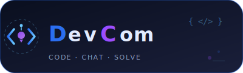

# DevCom
一个可以共同协作的平台。
在一个平台里，创作、分享、聊天。
## 本地部署：

推荐全局安装 docsify-cli 工具。

```bash

npm i docsify-cli -g

```

克隆仓库：

```bash

git clone https://github.com/mdevcom/mdevcom.github.io.git

```

运行：

```bash

docsify serve mdevcom.github.io

```

默认用的还是系统服务器，可以尝试使用[Firebase](https://console.firebase.google.com)新建项目：

- 点击 创建项目
- 输入项目名（比如：devcom）
- 创建项目
- 点击网页图标 </>
- 填一个应用名（比如 devcom）
- 点注册
- 保存类似这样的代码，替换到文件：
``` javascript

const firebaseConfig = {
  apiKey: "...",
  authDomain: "...",
  projectId: "...",
  ...
};

```
- 启用"firestore"，"邮箱验证"
Firestore:
- 点击“创建数据库”
- 选择 测试模式（先方便调试）
- 选默认地区
- 修改规则：
```javascript

rules_version = '2';
service cloud.firestore {
  match /databases/{database}/documents {
    // 用户只能读写自己的资料
    match /users/{userId} {
      allow read: if true;   // 公开资料允许所有人查看
      allow write: if request.auth != null && request.auth.uid == userId;
    }
    // 已登录用户可访问动态流
    match /feed/{docId} {
      allow read: if request.auth != null;
      allow create: if request.auth != null;
      allow update: if request.auth != null && request.auth.uid == resource.data.userId;
      allow delete: if request.auth != null && request.auth.uid == resource.data.userId;
    }
  }
}

```
接下来，注册Cloudinary
1. 登录后，进入 Settings → Upload → Upload presets，点击 “Add Upload Preset”。
2. 将 Signing Mode 设置为 Unsigned，并填写一个你记得住的 Preset name，之后在代码中会用到。
3. 保存预设。

在你的 dashboard.html 中，找到 <script type="module"> 的起始位置，紧接着替换下面的上传函数。请务必把 YOUR_CLOUD_NAME 和 YOUR_UPLOAD_PRESET 换成你自己的信息。

```javascript
// ==================== Cloudinary 配置 ====================
const CLOUDINARY_CLOUD_NAME = 'YOUR_CLOUD_NAME';      // 你的 Cloud Name
const UPLOAD_PRESET = 'YOUR_UPLOAD_PRESET';           // 刚刚创建的 Upload Preset

```

就完成了。
